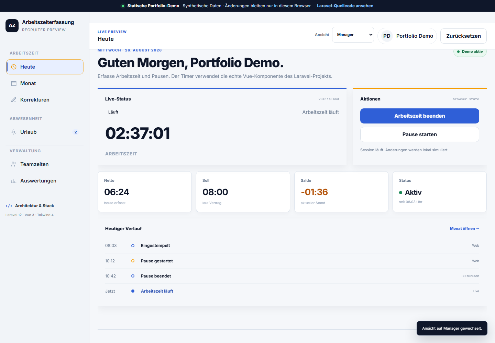

# Arbeitszeiterfassung

[](https://github.com/zerviate/arbeitszeiterfassung/actions/workflows/ci.yml)
[](https://github.com/zerviate/arbeitszeiterfassung/actions/workflows/pages.yml)

A role-aware work-time management application built as my final IHK apprenticeship project for application development. It covers daily time tracking, corrections, absences, compliance evaluation, reporting, exports, and auditability in one Laravel application.

**[Open the interactive recruiter demo](https://zerviate.github.io/arbeitszeiterfassung/)**



## About The Demo

The production application is a server-side Laravel project and therefore cannot execute on GitHub Pages. The linked preview is a separate static demo that:

- uses synthetic data only;
- reuses the application's visual system and real Vue timer component;
- simulates representative employee and manager workflows in the browser;
- stores changes only in local browser storage; and
- leaves the Laravel backend, domain services, policies, models, and migrations unchanged.

The demo is intended for quick portfolio review. The source in `app/`, `routes/`, `database/`, and `tests/` is the authoritative implementation.

## Features

- Clock-in, clock-out, and break tracking
- Day and month work-time summaries
- Time-correction requests with approval and rejection
- Contract-aware target-time calculation
- Holiday calendars and daily compliance evaluation
- Vacation requests, approval flows, and annual balances
- Sick-leave management
- Team and management views with role-based authorization
- Audit logging for sensitive changes
- CSV and Excel exports
- Security headers, login throttling, policy checks, and spreadsheet-value sanitization

## Architecture

The application is a Laravel monolith with server-rendered Blade views and focused Vue 3 islands.

| Layer | Main locations | Responsibility |
| --- | --- | --- |
| HTTP | `routes/`, `app/Http/` | Routing, authentication, validation, and controllers |
| Domain | `app/Services/`, `app/Policies/` | Work-time rules, absences, authorization, exports, and auditing |
| Data | `app/Models/`, `database/migrations/` | Eloquent models and relational persistence |
| UI | `resources/views/`, `resources/js/`, `resources/css/` | Blade pages, Vue islands, and Tailwind styling |
| Quality | `tests/Feature/`, `tests/Unit/` | Authorization, security, workflow, and calculation coverage |

## Technology

- PHP 8.2+ and Laravel 12
- Blade and Vue 3
- TypeScript and JavaScript
- Tailwind CSS 4 and Vite 7
- SQLite by default; MariaDB through DDEV
- PHPUnit 11
- Laravel Excel for CSV/XLSX exports

## Local Setup

### Standard PHP setup

Requires PHP 8.2+, Composer, Node.js 22.12+ or 24, and npm.

```bash
composer install
cp .env.example .env
php artisan key:generate
touch database/database.sqlite
php artisan migrate --seed
npm ci
npm run build
php artisan serve
```

Open `http://127.0.0.1:8000` and sign in with:

```text
email: test@example.com
password: password
```

The credentials are for local seeded development only. Do not deploy them to a public Laravel instance.

### DDEV setup

```bash
ddev start
ddev composer install
ddev exec "cp .env.example .env"
ddev exec "touch database/database.sqlite"
ddev artisan key:generate
ddev artisan migrate --seed
ddev npm ci
ddev npm run build
```

Open the project URL reported by `ddev describe`.

## Recruiter Demo Development

The Pages preview has its own Vite entry and does not require PHP:

```bash
npm ci
npm run build:demo
npm run preview:demo
```

The generated `dist-demo/` directory is deployed by `.github/workflows/pages.yml`.

## Tests And CI

```bash
php artisan test
npm run build
npm run build:demo
```

GitHub Actions installs dependencies, builds both frontends, runs migrations against SQLite, compiles Blade views, lists routes, and runs the PHP test suite.

## Data And Privacy

- The GitHub Pages demo contains no real employee or health data.
- Local `.env`, databases, logs, dependency directories, and build artifacts are not published.
- Do not upload a real application database to the repository or Pages artifact.
- The static demo does not provide authentication or server-side persistence and is clearly labelled as a simulation.

## Repository Map

```text
app/                    Laravel domain and HTTP code
database/               Migrations, factories, and local demo seeder
demo/                   Isolated GitHub Pages recruiter preview
resources/              Blade, Vue, JavaScript, and CSS sources
routes/                 Web, API, console, and schedule definitions
tests/                  PHPUnit feature and unit tests
vite.config.js          Laravel frontend build
vite.demo.config.js     Static Pages demo build
```

## Project Status

This repository is maintained as a portfolio and learning project. The GitHub Pages build is a reviewer-friendly preview; running the Laravel application locally remains the way to inspect complete backend behavior.
